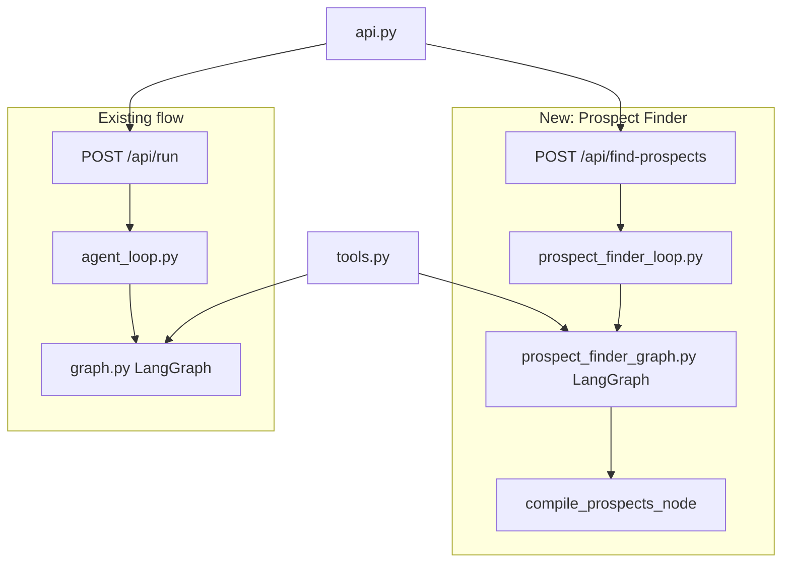
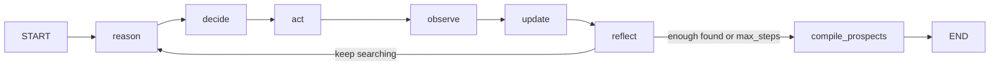

# Prospect Finder Agent

## Architecture overview




New files: `prospect_finder_graph.py`, `prospect_finder_loop.py`.
Modified files: `tools.py`, `api.py`, `documentation/API_DETAILS.md`.

---

## 1. New tool: `search_linkedin_companies` in [tools.py](c:\Cursor Projects\sales_rep_rag\tools.py)

Add a new function below the existing `search_web` section:

```python
def search_linkedin_companies(
    location: str,
    industry_hint: str = "",
    seller_description: str = "",
    max_results: int = 8,
) -> str:
    """
    Search DuckDuckGo for LinkedIn company pages matching a location + optional industry hint.
    Constructs queries like:
      site:linkedin.com/company "[location]" "[industry_hint]"
    Returns title, LinkedIn URL, and snippet for each result.
    """
```

Also add a simpler `fetch_company_info(company_name, location)` that runs a plain DuckDuckGo search for `"{company_name}" {location} company website industry size` — used by the agent to enrich a discovered company name with website/size/facts.

Both are thin wrappers around the existing `DDGS().text(...)` call — no new deps.

Add both to a new `get_prospect_finder_registry()` function (separate from `get_tool_registry()`):

```python
def get_prospect_finder_registry(my_company_description: str = "") -> Dict[str, ToolSpec]:
    return {
        "search_linkedin_companies": { ... },
        "fetch_company_info": { ... },
        "consult_oracle": { ... },   # reuse existing
    }
```

---

## 2. New: `prospect_finder_graph.py`

Separate LangGraph with its own `ProspectFinderState`:

```python
class ProspectFinderState(TypedDict):
    task: str                      # seller info + goal (find N companies in location)
    target_count: int
    location: str
    my_company_summary: str
    max_steps: int
    tool_descriptions: str
    step: int
    tools_used: List[str]
    memory_items: List[str]
    turn_history: List[Dict[str, Any]]
    found_companies: List[str]     # raw company names/URLs discovered so far
    reason_text: str
    decision: Dict[str, Any]
    tool_result: str
    tool_error: str
    observation: str
    reflection: Dict[str, Any]
    final_prospects: List[Dict[str, Any]]  # enriched output, set by compile node
```

Graph topology (same Reason → Decide → Act → Observe → Update → Reflect loop):




Key nodes:

- `**reason_node**` — Gap analysis: how many companies found vs. target, what locations/industries still need searching.
- `**decide_node**` — Adaptive rules: use `search_linkedin_companies` first, then `fetch_company_info` for enrichment, optionally `consult_oracle` if stuck. Stop when `len(found_companies) >= target_count` and enrichment is done.
- `**act_node**` — Same pattern as existing: run the selected tool, extract newly found company names from search results, append to `found_companies`.
- `**compile_prospects_node**` — Final node: one dedicated LLM call that takes all `memory_items` (accumulated search results) and formats them into a clean list of enriched prospect objects:

```
  [
    {
      "company_name": "...",
      "linkedin_url": "...",
      "website": "...",
      "industry": "...",
      "size_estimate": "...",
      "key_facts": ["...", "..."]
    },
    ...
  ]
  

```

  LLM is prompted to output JSON array; fallback: regex extraction of company names.

- `**route_after_reflect**` — Stop when `found_companies` has enough entries AND enrichment pass is done, OR `max_steps` reached.

---

## 3. New: `prospect_finder_loop.py`

Entry point mirroring `agent_loop.py`:

```python
def run_prospect_finder_flow(
    my_company_description: str,
    location: str,
    num_prospects: int,
    industry_focus: str = "",
    max_steps: Optional[int] = None,
    event_sink: Optional[Callable[[Dict[str, Any]], None]] = None,
) -> List[Dict[str, Any]]:
    """
    Find N prospect companies in a location.
    Returns list of enriched prospect dicts.
    Emits SSE events via event_sink if provided.
    """
```

Internally:

- Sets up file logging to `logs/prospect_run_YYYYMMDD_HHMMSS.txt`
- Attaches `EventSinkHandler` to `sales_rep.agent` when `event_sink` is set
- Builds and invokes `prospect_finder_graph.build_graph()`
- Emits `start`, `log`, `step`, `tool`, `done` events (same pattern as `agent_loop.py`)
- `done` event `result` field is `{"prospects": [...]}` with the enriched list

Task template for the LLM:

```
Seller (who you represent):
{my_company_description}

Goal: Find {num_prospects} real companies in {location} that could be valuable prospects
for the seller described above.
{industry_focus_line}

Use search_linkedin_companies to discover companies, then fetch_company_info to enrich each one.
For each found company, record: name, LinkedIn URL, website, industry, estimated size, key facts.
```

---

## 4. New endpoint in [api.py](c:\Cursor Projects\sales_rep_rag\api.py)

Add `POST /api/find-prospects` following the exact same thread + queue + SSE pattern:

```python
@app.post("/api/find-prospects")
def find_prospects(body: dict) -> StreamingResponse:
    """
    Body: my_company_description, location, num_prospects,
          optional industry_focus, optional max_steps.
    Response: SSE stream, same event types as /api/run.
    done.result = { "prospects": [...] }
    """
```

No new deps — same `queue`, `threading`, `StreamingResponse` imports already in `api.py`.

---

## 5. Update [documentation/API_DETAILS.md](c:\Cursor Projects\sales_rep_rag\documentation\API_DETAILS.md)

Add a new section documenting:

- `POST /api/find-prospects` — request body, response SSE event types (same `start`, `log`, `step`, `tool`, `done`), and `done.result.prospects` array shape (the enriched fields).

---

## Files summary


| File                                                                                          | Change                                                                                |
| --------------------------------------------------------------------------------------------- | ------------------------------------------------------------------------------------- |
| [tools.py](c:\Cursor Projects\sales_rep_rag\tools.py)                                         | Add `search_linkedin_companies`, `fetch_company_info`, `get_prospect_finder_registry` |
| New: `prospect_finder_graph.py`                                                               | LangGraph with `ProspectFinderState`, all nodes, `compile_prospects_node`             |
| New: `prospect_finder_loop.py`                                                                | `run_prospect_finder_flow` entry point, event_sink, file logging                      |
| [api.py](c:\Cursor Projects\sales_rep_rag\api.py)                                             | Add `POST /api/find-prospects` endpoint                                               |
| [documentation/API_DETAILS.md](c:\Cursor Projects\sales_rep_rag\documentation\API_DETAILS.md) | Document new endpoint and prospect object shape                                       |


