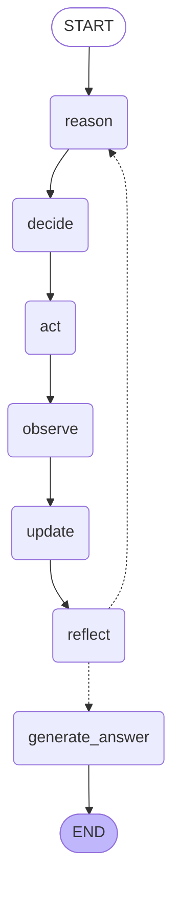

# Sales Rep RAG Agent

A local, fully-offline AI sales-rep assistant.  
Give it **who you represent** and a **prospect** (company, industry, profile text) and it returns a grounded **Value Hypothesis**, **Messaging Angle**, and **Supporting Evidence** — backed by a RAG vector store and live web search.

No external API keys required. Everything runs through a local [Ollama](https://ollama.ai) instance.

---

## How it works

The agent runs a structured **Reason → Decide → Act → Observe → Update → Reflect** loop managed by [LangGraph](https://langchain.com/langgraph).  
Before the loop starts, it builds a RAG vector index from your company description, the prospect profile, and optional web-search results, then retrieves relevant chunks at every step to keep the model grounded.

### Graph topology



| Node | What it does |
|---|---|
| **reason** | Asks "what do we know, what is missing?" Increments step counter. Retrieves fresh RAG chunks into context. |
| **decide** | LLM outputs a JSON decision: call a tool or stop. Retries on parse failure. |
| **act** | Runs the chosen tool (`search_web` or `extract_insights`). Saves search results back to the vector store for future retrieval steps. |
| **observe** | Formats the tool result/error into a readable observation string. |
| **update** | Appends the step summary to `memory_items` and `turn_history`. |
| **reflect** | Self-critique: is the info sufficient? Sets `confidence` and `should_revise`. |
| **generate_answer** | Dedicated final LLM call with all accumulated memory + one last retrieval pass → produces the three-section answer. |

**Routing after `reflect`:**

- `should_revise = True` → loop back to `reason`
- `step >= max_steps` → `generate_answer`
- `should_stop = True` and `confidence >= 0.6` and not "insufficient without using a tool" → `generate_answer`
- Everything else → loop back to `reason`

---

## File layout

```
sales_rep_rag/
├── config.py          # All settings (env-var overrideable)
├── graph.py           # LangGraph StateGraph: AgentState, all nodes, routing
├── agent_loop.py      # RAG setup, logging scaffold, run_sales_rep_flow() entry point
├── rag.py             # Document building, chunking, vector store, retriever
├── tools.py           # search_web (DuckDuckGo) + extract_insights (LLM over profile)
├── decisions.py       # Decision dataclass, parse_decision(), parse_reflection()
├── memory.py          # AgentMemory (append-only list with get_summary())
├── local_llm.py       # Direct Ollama HTTP client (complete, complete_structured)
├── run_sales_rep.py   # __main__ entry point
├── logs/              # Run logs (created automatically)
├── requirements.txt
└── documentation/
    └── README.md
```

---

## Quick start

### 1. Prerequisites

- [Ollama](https://ollama.ai) running locally (default: `http://localhost:11434`)
- A pulled model, e.g.:
  ```bash
  ollama pull deepseek-r1:8b
  ```

### 2. Install dependencies

```bash
pip install -r requirements.txt
```

> The sentence-transformers embedding model (`all-MiniLM-L6-v2`) is downloaded automatically on first run (~80 MB).

### 3. Run the example

```bash
python run_sales_rep.py
```

Or call from Python:

```python
from agent_loop import run_sales_rep_flow

result = run_sales_rep_flow(
    my_company_description="Acme Analytics: real-time dashboards for mid-market retailers.",
    prospect_company_name="RetailCo",
    prospect_industry="Retail",
    prospect_profile_text="200 stores in the Midwest, legacy POS, manual reporting.",
)

print(result["value_hypothesis"])
print(result["messaging_angle"])
print(result["supporting_evidence"])
```

**Output keys:**

| Key | Description |
|---|---|
| `value_hypothesis` | One or two sentences on the value you can deliver |
| `messaging_angle` | How to position the message |
| `supporting_evidence` | Concrete facts or bullets grounded in context |

---

## Configuration

All settings live in `config.py` and can be overridden with environment variables.

### LLM (Ollama)

| Variable | Default | Description |
|---|---|---|
| `OLLAMA_BASE_URL` | `http://localhost:11434` | Ollama server URL (local or remote GPU) |
| `OLLAMA_MODEL` | `deepseek-r1:8b` | Model to use for all LLM calls |

### Agent loop

| Variable | Default | Description |
|---|---|---|
| `MAX_STEPS` | `15` | Maximum Reason→Reflect cycles before forcing an answer |
| `MIN_CONFIDENCE_TO_STOP` | `0.6` | Minimum confidence score before accepting a stop decision |
| `MEMORY_RECENT_K` | `10` | How many recent turns to include in context |
| `DECIDE_PARSE_RETRIES` | `1` | Retries when the Decide JSON cannot be parsed |
| `MODEL_ERROR_RETRIES` | `2` | Retries on LLM connection/API errors |

### LangGraph

| Variable | Default | Description |
|---|---|---|
| `ENABLE_CHECKPOINTING` | `""` (off) | Set to `"1"` to enable MemorySaver in-process checkpointing |
| `GRAPH_RECURSION_LIMIT` | `140` | LangGraph safety limit on total node executions |

### RAG / Embeddings

| Variable | Default | Description |
|---|---|---|
| `EMBEDDING_MODEL` | `all-MiniLM-L6-v2` | sentence-transformers model (local, no API key) |
| `OLLAMA_EMBEDDING_MODEL` | `""` | If set, use Ollama for embeddings instead (e.g. `nomic-embed-text`) |
| `VECTOR_STORE_TYPE` | `memory` | `memory` = in-memory (per run) · `chroma` = persisted to disk |
| `VECTOR_STORE_PATH` | `./chroma_sales_rep` | Path for Chroma persistence (only used when `VECTOR_STORE_TYPE=chroma`) |
| `CHUNK_SIZE` | `800` | Characters per chunk (RecursiveCharacterTextSplitter) |
| `CHUNK_OVERLAP` | `150` | Overlap between chunks |
| `RETRIEVER_TOP_K` | `8` | Chunks retrieved per step |

---

## RAG knowledge sources

Three document sources are indexed before the loop starts:

| Source | Metadata | Content |
|---|---|---|
| **my_company** | `source: "my_company"` | Your company description |
| **prospect_profile** | `source: "prospect_profile"`, `company_name`, `industry` | Prospect company name + profile text |
| **search** | `source: "search"`, `url`, `query` | DuckDuckGo results from the initial `"{company} {industry}"` search |

During the loop, every `search_web` tool call also adds its results to the live vector store so the retriever sees them in all subsequent steps.

---

## Tools

| Tool | When used | What it does |
|---|---|---|
| `search_web` | When the profile is thin or industry context is missing | DuckDuckGo search, returns title + snippet + URL for each result |
| `extract_insights` | To structure an existing profile | Runs the LLM over the prospect profile text and extracts facts, pain points, and opportunities |

---

## Logging

Every run writes a detailed log to `logs/run_YYYYMMDD_HHMMSS.txt`:

- Full prompts and full model responses for every LLM call (Reason, Decide, Reflect, GenerateAnswer)
- `=== VECTOR DB FETCH ===` — retrieval query + every chunk returned (source, length, content)
- `=== SEARCH RUNNING ===` / `=== TOOL RESULT ===` — search query and raw results
- `=== VECTOR STORE (save) ===` — each document saved after a search_web call
- `[graph] node=... updated_keys=...` — real-time LangGraph node completion events
- `=== RUN COMPLETE ===` — final parsed three-section output

Third-party loggers (`httpcore`, `hpack`, `primp`, `ddgs`, etc.) are set to `WARNING` so the file stays readable.

---

## Persistent checkpointing (optional)

Set `ENABLE_CHECKPOINTING=1` to compile the graph with a `MemorySaver`.  
Each run is identified by a `thread_id` (`{prospect_company}_{timestamp}`) stored in `config["configurable"]`.  
This allows resuming interrupted runs or inspecting intermediate state after the fact.

```bash
ENABLE_CHECKPOINTING=1 python run_sales_rep.py
```

---

## Remote Ollama / GPU server

Point the agent at a remote Ollama instance:

```bash
OLLAMA_BASE_URL=http://my-gpu-server:11434 OLLAMA_MODEL=qwen3:8b python run_sales_rep.py
```

---

## Dependencies

| Package | Purpose |
|---|---|
| `langchain`, `langchain-core`, `langchain-community`, `langchain-text-splitters` | RAG pipeline (embeddings, vector store, retriever, document types) |
| `langgraph` | Agent workflow graph (StateGraph, nodes, conditional routing, checkpointing) |
| `sentence-transformers` | Local embeddings — no API key needed |
| `ddgs` | DuckDuckGo search — no API key needed |
| `chromadb` *(optional)* | Persistent vector store; uncomment in `requirements.txt` to enable |
